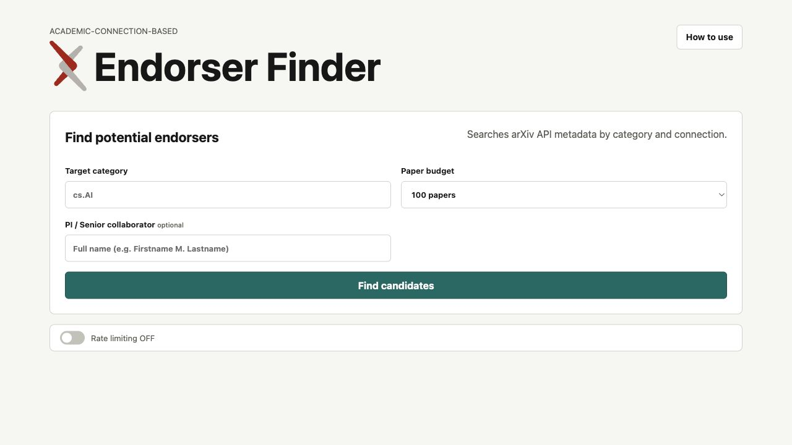
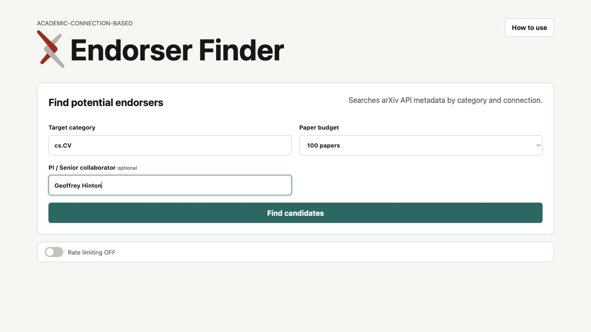
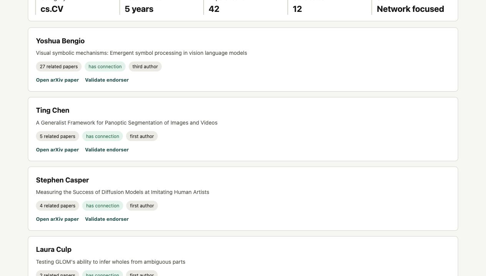

# arXiv Endorser Finder

Find likely arXiv endorsement candidates from recent arXiv metadata. The website is
designed for researchers who need a practical starting list of people to check.



## What This Tool Does

- Searches official arXiv API metadata by target category.
- Optionally uses a PI or senior collaborator name to find nearby coauthor
  network candidates.
- Ranks candidates with simple signals: category activity, author position,
  repeated recent papers, PI/coauthor connection, and recency.
- Links each candidate to the source arXiv paper.
- Provides a shortcut to arXiv's manual "Which authors of this paper are
  endorsers?" page.

## What It Does Not Do

- It does not log in to arXiv.
- It does not automatically verify endorsement eligibility.
- It does not crawl or batch-access arXiv validation pages.
- It does not scrape emails, contact candidates, or guarantee endorsement.

## How To Use

### 1. Enter A Target Category

Type an official arXiv category code such as `cs.CV`, `cs.AI`,
`physics.optics`, or `stat.ML`.

The category must match an official arXiv category exactly.

### 2. Choose A Paper Budget

Pick how many recent papers to search. Start with `100 papers` for a quick
check. Increase the budget when the category is sparse or you want broader
coverage.

### 3. Add A PI Or Senior Collaborator

The collaborator field is optional. Add a full name when you want the search to
focus on people near that research network.



### 4. Review Candidate Results

Click `Find candidates`. The app returns a ranked list of potential candidates.
Each card includes:

- candidate name,
- source paper title,
- number of related papers found,
- whether the candidate has a PI/coauthor connection,
- author-role signal,
- `Open arXiv paper`,
- `Validate endorser`.



### 5. Validate On arXiv

Use `Open arXiv paper` to inspect the source publication.

Use `Validate endorser` to open arXiv's manual endorser page for that paper:

```text
Which authors of this paper are endorsers?
```

arXiv may ask you to log in before showing the validation page. The final
eligibility decision happens on arXiv, not inside this app.

## Tips

- Use exact arXiv category names.
- Try a larger paper budget if results are thin.
- Add a PI or senior collaborator name when you care about network proximity.
- Treat results as leads to review, not verified endorsers.

## Development

```bash
npm start
```

The server listens on `http://localhost:3000` by default. Set `PORT` to use a
different port:

```bash
PORT=3001 npm start
```
